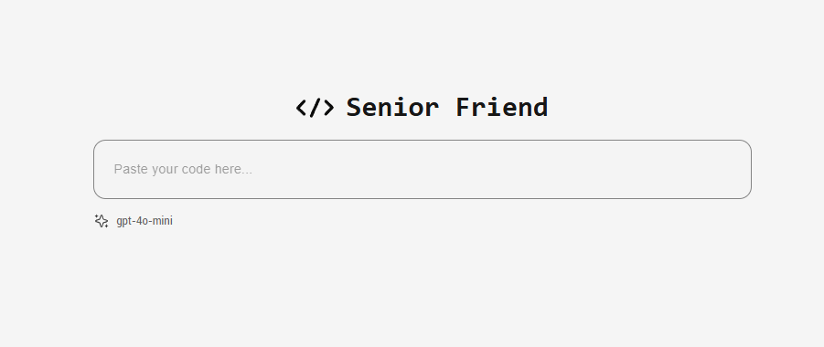
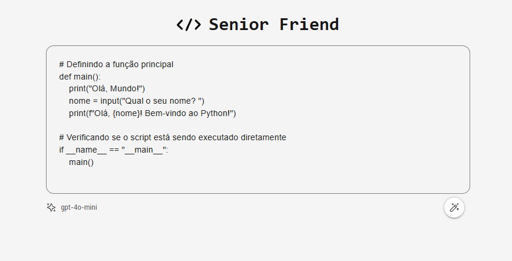
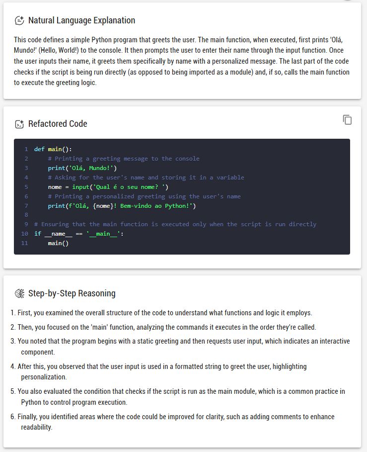
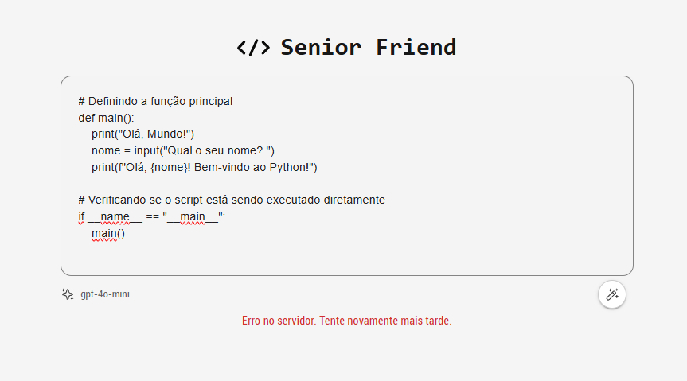
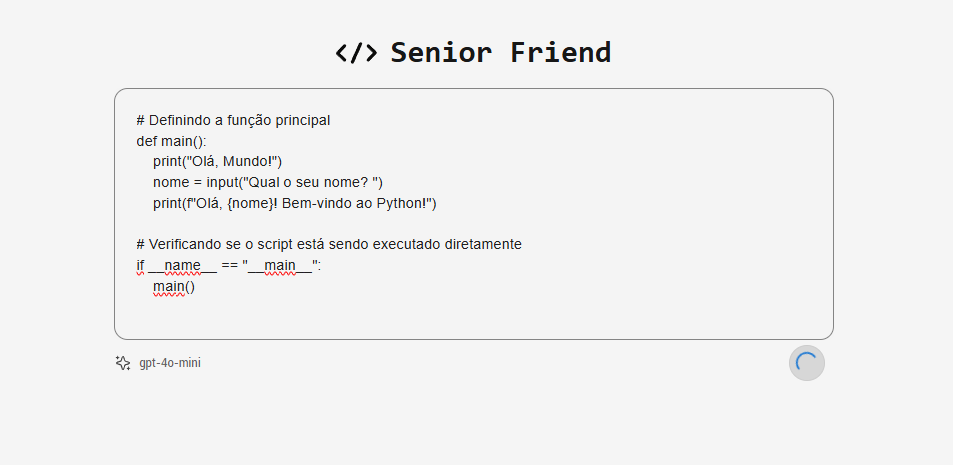
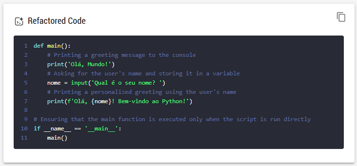

# Senior Friend

# Evaluation

## 1. Does the app deliver the required three outputs from the user’s code input?
Yes, the app provides the three required outputs:

- **Natural Language Explanation**: A description of what the code does.
- **Refactored Code**: An improved version of the code.
- **Step-by-Step Reasoning**: A detailed breakdown of the analysis process.

These are returned in the response from the `analyzeCode` function in `AnalyzerController`, which correctly passes the results to the frontend.

## 2. Is the code organized, readable, and maintainable?
The code is well-structured and follows a modular approach:

- **Backend**: The code is separated into controllers, services, routes, and plugins, adhering to the single responsibility principle. Each file has a clear responsibility, and there is appropriate error handling (e.g., try-catch in `AnalyzerController`).
- **Frontend**: The React components are logically divided (`CodeInput`, `ResultSection`, etc.) and follow modern practices. The use of hooks and state management is clean and efficient.
- **Tests**: You’ve implemented both unit and integration tests, which helps with maintainability. Mocking dependencies like `OpenAIService` is a good practice for isolating tests.

Overall, the code is clean, readable, and maintainable.

## 3. Does the UI provide a good user experience and handle errors/loading states?
Yes, the UI is designed with a good user experience in mind:

- **Error Handling**: The frontend provides error feedback (e.g., "Serviço indisponível no momento") when there’s an issue with the server or the code analysis fails. The backend also responds with appropriate error messages and HTTP status codes.

- **Loading States**: The UI shows a loading spinner while the analysis is in progress, ensuring users are informed that the process is ongoing.

- **UI Components**: The use of Material-UI (MUI) components like `TextField`, `Button`, and `CircularProgress` provides a clean and responsive interface. The floating action button for submission is user-friendly and visually clear.
- **Language Detection and Syntax Highlighting**: The frontend includes a feature that automatically detects the programming language of the code and highlights the syntax accordingly. This enhances the readability and understanding of the code for users.
- **Code Copying Feature**: The app allows users to easily copy the refactored code with a simple click, providing a convenient way to use the improved version of the code.

## 4. Is the OpenAI integration correct and secure?
Yes, the OpenAI integration appears correct:

- **API Key**: The API key is securely stored in the `.env` file, which is read by the backend. This ensures that sensitive data is not exposed.
- **Request to OpenAI**: The backend correctly handles the request to OpenAI’s API, using `openai.chat.completions.create` to send the code and receive the analysis response.
- **Error Handling**: The backend properly handles errors when interacting with the OpenAI API, logging detailed information when an error occurs.
- **Security Considerations**: You are correctly using environment variables to store sensitive information like the API key. However, it is important to ensure that `.env` files are never exposed in public repositories.

## 5. Stretch goals: What other cool features would you want to add if you had more time and how would you implement them? Describe these in the README.
Here are some potential features to consider:

- **Code Optimization Suggestions**: Extend the `OpenAIService` to analyze code for performance bottlenecks or memory inefficiencies and suggest improvements. This can be done by expanding the prompts sent to OpenAI to include performance-related queries.
  
- **Multiple Language Support**: Add support for analyzing code in multiple programming languages. You could implement a language detection feature in the frontend or backend and send this information to OpenAI for context-aware analysis.

- **Code Visualization**: Implement a feature that allows users to visualize their code structure or flow (e.g., flowcharts or UML diagrams) based on the analysis. This would require integrating a code-to-graph library and modifying the OpenAI prompt to generate more structured outputs.

- **User Authentication and History**: Allow users to register and log in to save their code snippets and view past analyses. This could be implemented with JWT authentication and a database to store user data and history.

- **Refactoring Mode**: Allow users to submit refactor requests along with the code, such as suggesting improvements for readability, performance, or modularity.

These features could be added incrementally depending on the time available and would enhance both the functionality and usability of the app.

