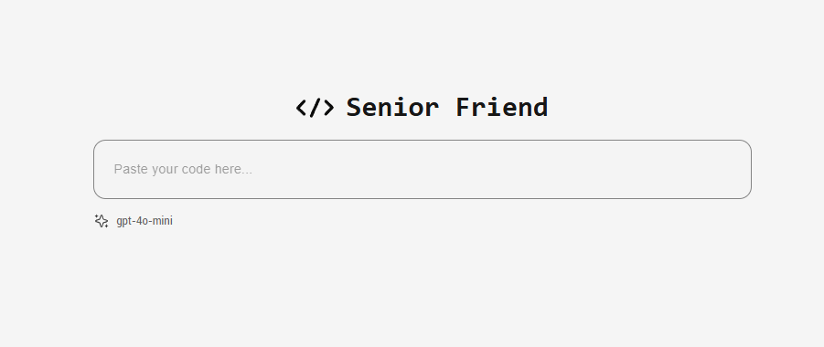
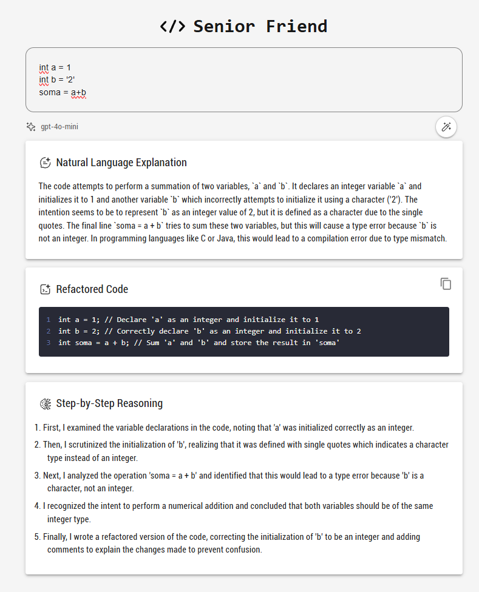
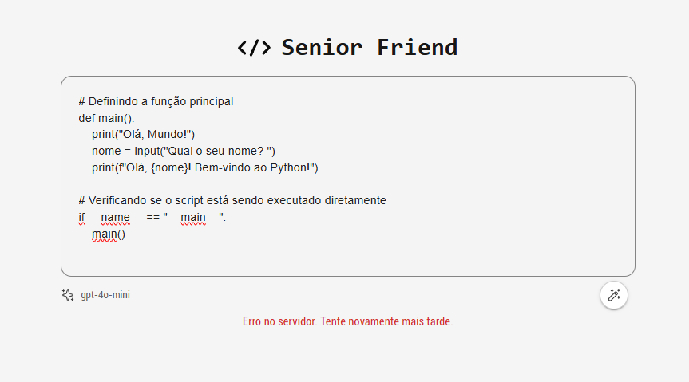
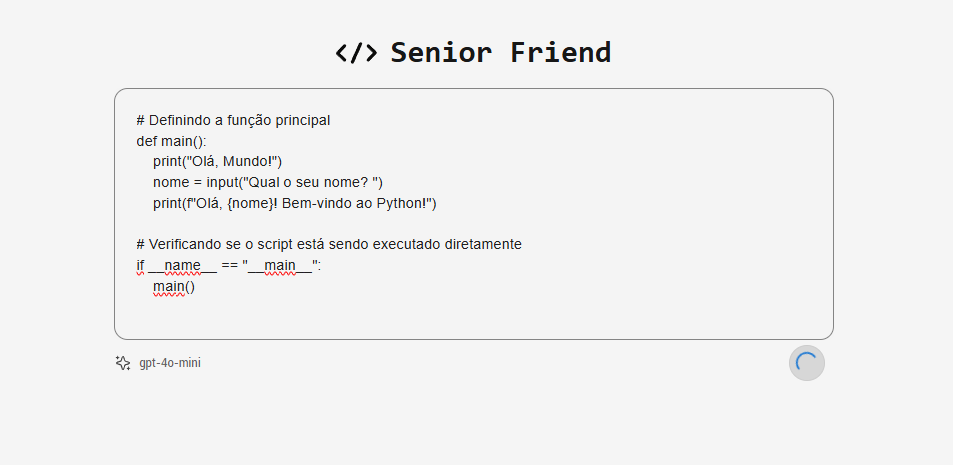
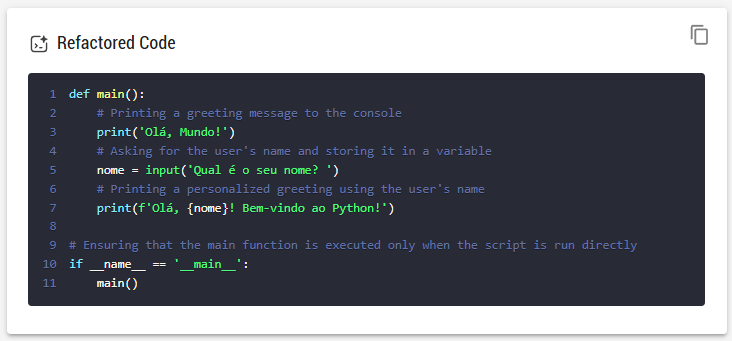

# Senior Friend


# Instructions

## Environment Variables

- Ensure that you have a `.env` file in the root of the backend directory containing your OpenAI API key:
    ```
    OPENAI_API_KEY=your-api-key-here
    ```

    Replace `your-api-key-here` with your actual OpenAI API key.

## Backend Setup

1. **Navigate to the backend directory**:
    ```bash
    cd backend
    ```

2. **Install the dependencies**:
    ```bash
    npm install
    ```

3. **Start the backend server**:
    ```bash
    npm start
    ```

    This will start the Fastify server for the API.

## Frontend Setup

1. **Navigate to the frontend directory**:
    ```bash
    cd frontend
    ```

2. **Install the dependencies**:
    ```bash
    npm install
    ```

3. **Run the frontend development server**:
    ```bash
    npm run dev
    ```

    This will start the Next.js development server for the frontend application.

4. **Alternatively, build and start the production version**:
    ```bash
    npm run build
    npm start
    ```

    This will build the frontend application and start the production server.

## Tests
1. **To run unit and integration tests**:
    ```bash
    npm test
    ```

## Running the App

After setting up both the backend and frontend, you can visit the frontend at [http://localhost:3000](http://localhost:3000) and interact with the app.


# Evaluation

## 1. Does the app deliver the required three outputs from the user’s code input?
Yes, the app provides the three required outputs:

- **Natural Language Explanation**: A description of what the code does.
- **Refactored Code**: An improved version of the code.
- **Step-by-Step Reasoning**: A detailed breakdown of the analysis process.



These are returned in the response from the `analyzeCode` function in `AnalyzerController`, which correctly passes the results to the frontend.

## 2. Is the code organized, readable, and maintainable?
The code is well-structured and follows a modular approach:

- **Backend**: The code is separated into controllers, services, routes, and plugins, adhering to the single responsibility principle. Each file has a clear responsibility, and there is appropriate error handling (e.g., try-catch in `AnalyzerController`).
- **Frontend**: The React components are logically divided (`CodeInput`, `ResultSection`, etc.) and follow modern practices. The use of hooks and state management is clean and efficient.
- **Tests**: I have implemented both unit and integration tests, which helps with maintainability. Mocking dependencies like `OpenAIService` is a good practice for isolating tests.

Overall, the code is clean, readable, and maintainable.

### Project Structure

#### /src (Backend)
  - **/config**
    - `environment.js`
  - **/controllers**
    - `analyzer.controller.js`
  - **/plugins**
    - `cors.js`
  - **/routes**
    - `analyzer.routes.js`
  - **/services**
    - `openai.service.js`
  - **/tests**
    - **/integration**
      - `routes.test.js`
    - **/unit**
      - `analyzer.controller.test.js`
      - `openai.service.test.js`
  - `app.js`
  - `server.js`

#### /frontend (Frontend)
  - **/components**
    - **/CodeAnalyzer**
      - `CodeInput.js`
      - `index.js`
      - `ResultSection.js`
    - **/ui**
      - `IconWithLabel.js`
  - **/pages**
    - `index.js`
  - **/utils**
    - `codeUtils.js`
 

## 3. Does the UI provide a good user experience and handle errors/loading states?

- **Error Handling**: The frontend provides error feedback (e.g., "Serviço indisponível no momento") when there’s an issue with the server or the code analysis fails. The backend also responds with appropriate error messages and HTTP status codes.

- **Loading States**: The UI shows a loading spinner while the analysis is in progress, ensuring users are informed that the process is ongoing.

- **UI Components**: The use of Material-UI (MUI) components like `TextField`, `Button`, `CircularProgress`, and icons provides a clean and responsive interface. The floating action button for submission is user-friendly and visually clear.
- **Language Detection and Syntax Highlighting**: The frontend includes a feature that automatically detects the programming language of the code and highlights the syntax accordingly. This enhances the readability and understanding of the code for users.
- **Code Copying Feature**: The app allows users to easily copy the refactored code with a simple click, providing a convenient way to use the improved version of the code.



## 4. Is the OpenAI integration correct and secure?
Yes, the OpenAI integration is correct and secure:

- **API Key**: The API key is securely stored in the `.env` file, which is read by the backend. This ensures that sensitive data is not exposed.
- **Request to OpenAI**: The backend correctly handles the request to OpenAI’s API, using `openai.chat.completions.create` to send the code and receive the analysis response.
- **Error Handling**: The backend properly handles errors when interacting with the OpenAI API, logging detailed information when an error occurs.
- **Security Considerations**: It's important to ensure that `.env` files are never exposed in public repositories.

## 5. Stretch goals: What other cool features would you want to add if you had more time and how would you implement them? Describe these in the README.

- **Code Optimization Suggestions**: Extend the `OpenAIService` to analyze code for performance bottlenecks or memory inefficiencies and suggest improvements. This can be done by expanding the prompts sent to OpenAI to include performance-related queries.
  
- **User Authentication and History**: Allow users to register and log in to save their code snippets and view past analyses. This could be implemented with JWT authentication and a database to store user data and history.

- **Upload and Analyze Code from ZIP Files**: Add functionality to allow users to upload a ZIP file containing multiple source code files. The system would extract the files, read their contents, and analyze them as part of the code analysis process. This could be implemented by integrating a ZIP file parsing library and updating the frontend to handle file uploads and display the results.

- **Convert Code Image to OCR**: Implement a feature that allows users to upload an image of handwritten or printed code, and the system would extract the code using Optical Character Recognition (OCR). This could be done by integrating an OCR library (like Tesseract.js or a similar service) into the backend. The extracted code can then be passed for analysis in the same way as typed code.

- **Execute Code Snippet Feature**: Add a feature to execute code snippets directly within the app. Users can paste code, choose a language, and see the output in real-time.


