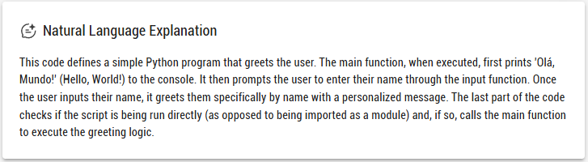
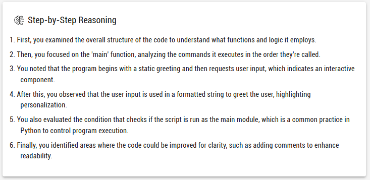

# plankton

Este projeto é uma aplicação full-stack que utiliza **Next.js** para o frontend e Node + **Fastify** para o backend. Ele foi configurado para utilizar a API da OpenAI para interação com modelos de linguagem.

